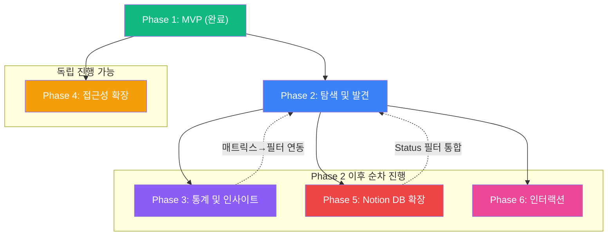

# 치과 AI 아이디어 로그북 - 고도화 로드맵

## 프로젝트 현황

**치과 AI 아이디어 로그북**은 Notion을 CMS로 활용하여 치과 AI 아이디어를 구조화하고 웹에서 공개 조회할 수 있는 아이디어 저장소입니다.

### MVP 완료 상태

- Notion DB 연동 아이디어 목록/상세 조회
- 태그 기반 분류 표시 (대상별, 영역별)
- 반응형 UI (카드 리스트 + 상세 페이지)
- Vercel 배포 완료

### 고도화 방향

MVP는 "보여주기"에 집중했다면, 고도화는 **탐색 -> 인사이트 -> 확산 -> 확장 -> 인터랙션** 순으로 사용자 가치를 단계적으로 높여갑니다.

---

## 진행 현황 요약

| 단계 | 상태 | 핵심 목표 |
|------|------|-----------|
| Phase 1: MVP | 완료 | Notion 연동 + 조회 + 배포 |
| Phase 2: 탐색 및 발견 | 대기 | 필터링, 검색, 정렬 |
| Phase 3: 통계 및 인사이트 | 대기 | 대시보드, 매트릭스, 추천 |
| Phase 4: 접근성 확장 | 대기 | SEO, 공유, RSS |
| Phase 5: Notion DB 확장 | 대기 | 신규 필드 + 상태 관리 |
| Phase 6: 인터랙션 | 대기 | 공감/투표, 댓글 |

---

## Phase 2: 탐색 및 발견

> 사용자가 원하는 아이디어를 빠르게 찾을 수 있도록 탐색 경험을 개선한다.

### 목표

- 클라이언트 사이드 필터링/검색/정렬 구현
- URL 쿼리 파라미터로 필터 상태를 공유 가능하게 함

### 작업 내용

#### 2-1. 필터 스토어 및 필터 패널

- `src/stores/useFilterStore.ts` 생성 (Zustand)
  - 대상(Target), 영역(Category), 사업성, 난이도 필터 상태
  - 필터 초기화/토글 액션
- `src/components/FilterPanel.tsx` 생성
  - 태그 기반 토글 UI (다중 선택)
  - 활성 필터 표시 및 전체 해제 버튼
  - 반응형: 모바일에서 접기/펼치기

#### 2-2. 텍스트 검색

- `src/components/SearchBar.tsx` 생성
  - 제목 + 문제 정의(Problem) 필드 대상 검색
  - 디바운스 적용 (300ms)
  - 검색어 하이라이트 (선택)

#### 2-3. 정렬 옵션

- `src/components/SortSelect.tsx` 생성
  - 정렬 기준: 최신순 / 사업성 높은순 / 난이도 낮은순
  - useFilterStore에 정렬 상태 통합

#### 2-4. URL 쿼리 파라미터 동기화

- 필터/검색/정렬 상태를 URL 쿼리 파라미터에 반영
- 공유 시 동일한 필터 상태로 복원 가능
- TanStack Router의 `searchParams` 활용

### 수정/생성 파일

| 파일 | 작업 |
|------|------|
| `src/stores/useFilterStore.ts` | 신규 생성 |
| `src/components/FilterPanel.tsx` | 신규 생성 |
| `src/components/SearchBar.tsx` | 신규 생성 |
| `src/components/SortSelect.tsx` | 신규 생성 |
| `src/pages/HomePage.tsx` | 필터/검색/정렬 통합 |
| `src/app/router.tsx` | searchParams 스키마 추가 |

### 완료 기준

- [ ] 대상/영역/사업성/난이도 필터가 동작하고 복수 선택 가능
- [ ] 검색어 입력 시 제목+문제 정의에서 일치하는 아이디어만 표시
- [ ] 정렬 변경 시 카드 순서가 즉시 반영
- [ ] URL 쿼리 파라미터로 필터 상태가 유지되고 공유 가능
- [ ] 모바일에서 필터 패널이 접기/펼치기로 동작

### 의존성

- Phase 1 (MVP) 완료 필수

---

## Phase 3: 통계 및 인사이트

> 축적된 아이디어에서 패턴과 인사이트를 발견할 수 있는 시각화를 제공한다.

### 목표

- 아이디어 통계 대시보드 구현
- 사업성-난이도 매트릭스로 전략적 판단 지원
- 상세 페이지에서 관련 아이디어 추천

### 작업 내용

#### 3-1. 대시보드 페이지 (`/dashboard`)

- `src/pages/DashboardPage.tsx` 생성
- 통계 카드: 총 아이디어 수, 카테고리별 분포, 대상별 분포
- 사업성/난이도 분포 차트 (CSS 기반 또는 가벼운 차트 라이브러리)

#### 3-2. 사업성-난이도 매트릭스 뷰

- `src/components/MatrixView.tsx` 생성
- 2x3 또는 3x3 매트릭스 그리드
- 각 셀에 해당 아이디어 수 표시, 클릭 시 필터 연동

#### 3-3. 관련 아이디어 추천

- `src/components/RelatedIdeas.tsx` 생성
- 상세 페이지 하단에 표시
- 동일 카테고리/대상 태그 기반 매칭 (최대 3개)

### 수정/생성 파일

| 파일 | 작업 |
|------|------|
| `src/pages/DashboardPage.tsx` | 신규 생성 |
| `src/components/MatrixView.tsx` | 신규 생성 |
| `src/components/RelatedIdeas.tsx` | 신규 생성 |
| `src/components/StatCard.tsx` | 신규 생성 |
| `src/app/router.tsx` | `/dashboard` 라우트 추가 |
| `src/components/layout/Header.tsx` | 대시보드 네비게이션 추가 |
| `src/pages/IdeaDetailPage.tsx` | 관련 아이디어 섹션 추가 |

### 완료 기준

- [ ] `/dashboard`에서 전체 통계 (총 개수, 카테고리/대상 분포) 확인 가능
- [ ] 사업성-난이도 매트릭스에서 아이디어 분포를 시각적으로 파악 가능
- [ ] 매트릭스 셀 클릭 시 해당 조건의 아이디어 목록으로 이동
- [ ] 상세 페이지 하단에 관련 아이디어 최대 3개 표시
- [ ] 반응형 레이아웃 적용

### 의존성

- Phase 2 (필터링)와 병행 가능하나, 매트릭스 -> 필터 연동은 Phase 2 완료 후

---

## Phase 4: 접근성 확장

> SEO 최적화와 공유 기능으로 아이디어의 외부 노출과 확산을 극대화한다.

### 목표

- 검색 엔진 최적화 (SEO)
- 소셜 미디어 공유 기능
- RSS 피드로 구독 지원

### 작업 내용

#### 4-1. 메타태그 관리

- `react-helmet-async` 도입
- 페이지별 `<title>`, `<meta description>`, Open Graph 태그 설정
- 상세 페이지: 아이디어 제목/문제 정의를 동적 메타태그로 반영

#### 4-2. 공유 기능

- `src/components/ShareButton.tsx` 생성
- Web Share API 지원 시 네이티브 공유, 미지원 시 클립보드 복사
- 상세 페이지에 공유 버튼 배치

#### 4-3. RSS 피드

- `api/feed.ts` 생성 (Vercel Serverless Function)
- RSS 2.0 형식으로 최신 아이디어 피드 제공
- `/api/feed` 엔드포인트

#### 4-4. OG 이미지 자동 생성 (선택)

- `api/og.ts` 생성
- `@vercel/og` 또는 Satori를 활용한 동적 OG 이미지
- 아이디어 제목 + 카테고리 정보 포함

### 수정/생성 파일

| 파일 | 작업 |
|------|------|
| `src/components/ShareButton.tsx` | 신규 생성 |
| `src/components/SEOHead.tsx` | 신규 생성 |
| `api/feed.ts` | 신규 생성 |
| `api/og.ts` | 신규 생성 (선택) |
| `src/pages/IdeaDetailPage.tsx` | 공유 버튼 + SEO 메타태그 추가 |
| `src/pages/HomePage.tsx` | SEO 메타태그 추가 |
| `src/app/App.tsx` | HelmetProvider 래핑 |

### 완료 기준

- [ ] 각 페이지에 적절한 `<title>`, `<meta>`, OG 태그가 설정됨
- [ ] 상세 페이지 공유 시 아이디어 제목과 설명이 미리보기에 표시됨
- [ ] Web Share API 지원 브라우저에서 네이티브 공유 동작
- [ ] `/api/feed`에서 유효한 RSS 2.0 XML이 반환됨

### 의존성

- Phase 1 (MVP) 완료 후 독립 진행 가능
- Phase 2, 3과 병행 가능

---

## Phase 5: Notion DB 확장

> Notion 데이터베이스에 신규 필드를 추가하여 아이디어 관리를 고도화한다.

### 목표

- 아이디어 상태 관리 (Status) 도입
- 참고 자료(References), 키워드(Keywords) 필드 추가
- 확장된 필드를 타입/API/UI에 반영

### 작업 내용

#### 5-1. Notion DB 필드 추가

| 신규 필드 | 타입 | 설명 |
|-----------|------|------|
| Status | Select | 아이디어 / 검토 중 / 진행 중 / 완료 / 보류 |
| References | URL | 관련 논문, 기사, 제품 링크 |
| Keywords | Multi-select | 검색 및 분류용 키워드 |

#### 5-2. 타입 및 API 확장

- `src/types/idea.ts`: `Status`, `References`, `Keywords` 필드 추가
- `api/_types/idea.ts`: 서버측 타입 동기화
- `api/_lib/parseNotionPage.ts`: 신규 필드 파싱 로직 추가

#### 5-3. UI 확장

- 상세 페이지에 Status 배지, References 링크 목록, Keywords 태그 표시
- 목록 페이지 카드에 Status 배지 추가

#### 5-4. 상태 기반 필터

- Phase 2의 FilterPanel에 Status 필터 추가
- "공개 아이디어만 보기" 등 상태 기반 뷰 지원

### 수정/생성 파일

| 파일 | 작업 |
|------|------|
| `src/types/idea.ts` | 필드 추가 |
| `api/_types/idea.ts` | 필드 추가 |
| `api/_lib/parseNotionPage.ts` | 파싱 로직 추가 |
| `src/components/IdeaCard.tsx` | Status 배지 표시 |
| `src/components/IdeaDetail.tsx` | References, Keywords 섹션 추가 |
| `src/stores/useFilterStore.ts` | Status 필터 추가 |
| `src/components/FilterPanel.tsx` | Status 필터 UI 추가 |

### 완료 기준

- [ ] Notion DB에 Status, References, Keywords 필드가 추가됨
- [ ] API 응답에 신규 필드가 포함됨 (null 허용, 하위호환 유지)
- [ ] 상세 페이지에서 Status, References, Keywords가 표시됨
- [ ] Status 기반 필터링이 동작함
- [ ] 기존 데이터(신규 필드 미입력)에서도 오류 없이 동작

### 의존성

- Phase 2 (필터링) 완료 후 진행 권장 (Status 필터 통합)
- Notion DB 수동 설정 필요

---

## Phase 6: 인터랙션

> 방문자가 아이디어에 가벼운 피드백을 남길 수 있는 인터랙션을 추가한다.

### 목표

- 공감/투표 기능으로 아이디어 관심도 파악
- 댓글 시스템으로 의견 교환 지원
- 인기순 정렬로 콘텐츠 발견성 향상

### 작업 내용

#### 6-1. 공감/투표

- `src/components/VoteButton.tsx` 생성
- 저장소 선택지:
  - **Vercel KV** (Redis): 빠르고 간단, 별도 DB 불필요
  - **Notion DB 필드**: Votes 필드 추가, API로 업데이트 (속도 제한 주의)
- 중복 투표 방지: localStorage 기반 (비로그인 환경)
- 상세 페이지 + 카드에 투표 수 표시

#### 6-2. 댓글

- [giscus](https://giscus.app/) 연동 (GitHub Discussions 기반)
- `src/components/Comments.tsx` 생성
- 상세 페이지 하단에 댓글 영역 배치
- GitHub 계정으로 로그인 후 댓글 작성

#### 6-3. 인기 아이디어 정렬

- Phase 2의 SortSelect에 "인기순" 옵션 추가
- 투표 수 기준 정렬

### 수정/생성 파일

| 파일 | 작업 |
|------|------|
| `src/components/VoteButton.tsx` | 신규 생성 |
| `src/components/Comments.tsx` | 신규 생성 |
| `api/votes/[id].ts` | 신규 생성 (투표 API) |
| `src/pages/IdeaDetailPage.tsx` | 투표 + 댓글 섹션 추가 |
| `src/components/IdeaCard.tsx` | 투표 수 표시 |
| `src/components/SortSelect.tsx` | 인기순 옵션 추가 |

### 완료 기준

- [ ] 아이디어별 공감/투표가 가능하고 수가 표시됨
- [ ] 동일 브라우저에서 중복 투표 방지
- [ ] giscus 댓글이 상세 페이지에서 정상 동작
- [ ] 인기순 정렬 시 투표 수 기준으로 카드가 정렬됨

### 의존성

- Phase 2 (정렬) 완료 후 인기순 정렬 추가 가능
- 투표 API는 독립적으로 개발 가능

---

## Phase 의존성 다이어그램

### 권장 진행 순서

1. **Phase 2** (탐색 및 발견) - 가장 즉각적인 사용자 가치
2. **Phase 4** (접근성 확장) - Phase 2와 병행 가능
3. **Phase 3** (통계 및 인사이트) - 데이터가 쌓인 후 가치 극대화
4. **Phase 5** (Notion DB 확장) - 운영 경험 축적 후 필드 설계
5. **Phase 6** (인터랙션) - 방문자 확보 후 피드백 루프 구축

---

## 기술적 고려사항

### Notion API 제한

- **속도 제한**: 초당 3 요청 (Integration 기준)
- **대응**: TanStack Query 캐싱 (staleTime), ISR 패턴 활용
- **투표 기능**: Notion DB 직접 업데이트 시 속도 제한 주의 → Vercel KV 권장

### 클라이언트 사이드 아키텍처

- 현재 구조: Vite + React SPA + Vercel Serverless Functions
- 모든 필터링/검색/정렬은 **클라이언트 사이드**에서 처리 (데이터 규모 100건 미만 예상)
- 데이터가 크게 증가하면 서버 사이드 필터링 전환 검토

### 상태 관리 전략

- **서버 상태**: TanStack Query (아이디어 목록/상세, 투표 수)
- **클라이언트 상태**: Zustand (필터, 정렬, UI 상태)
- **URL 상태**: TanStack Router searchParams (필터 공유)

### SEO 한계 및 대응

- SPA 구조 → 크롤러 접근성 제한
- `react-helmet-async`로 메타태그 관리
- 필요 시 Prerender.io 또는 SSR 전환 검토 (대규모 개편)

### 배포 환경

- Vercel 무료 플랜 기준
- Serverless Functions: 12개/프로젝트, 10초 타임아웃
- Vercel KV (투표 저장): 무료 플랜 30,000 요청/월

---

문서 버전: v1.0
최종 업데이트: 2026-03-06
범위: MVP 이후 고도화 (Phase 2~6)
전제: Notion CMS 유지, 공개 읽기 전용
