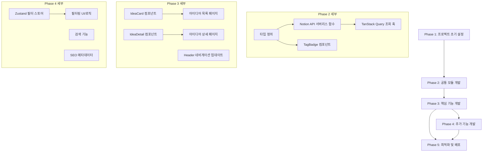

# 치과 AI 아이디어 로그북 - 개발 로드맵

Notion을 CMS로 활용하여 치과 AI 아이디어를 구조화하고 웹에서 공개 조회할 수 있는 아이디어 저장소

## 진행 현황 요약

| 단계 | 상태 | 완료율 |
|------|------|--------|
| Phase 1: 프로젝트 초기 설정 | 완료 | 100% |
| Phase 2: 공통 모듈 개발 | 진행 중 | 80% |
| Phase 3: 핵심 기능 개발 | 대기 | 0% |
| Phase 4: 추가 기능 개발 | 대기 | 0% |
| Phase 5: 최적화 및 배포 | 대기 | 0% |
| **전체** | **Phase 2 진행 중** | **4/17 작업 완료 (24%)** |

---

## 기술 스택

| 구분 | 기술 |
|------|------|
| Build Tool | Vite 7 |
| Frontend | React 19 + TypeScript 5.9 |
| Routing | TanStack Router |
| 서버 상태 관리 | TanStack Query |
| 클라이언트 상태 관리 | Zustand |
| Styling | Tailwind CSS 4 + shadcn/ui |
| Icons | Lucide React |
| Form | React Hook Form + Zod |
| CMS | Notion API (@notionhq/client v4) |
| Serverless API | Vercel Functions (@vercel/node) |
| 배포 | Vercel |

---

## 프로젝트 구조

```
src/
├── app/
│   ├── App.tsx              # 루트 앱 컴포넌트
│   ├── main.tsx             # 엔트리 포인트
│   └── router.tsx           # TanStack Router 설정
├── components/
│   ├── ui/                  # shadcn/ui 컴포넌트 (button, card, badge, form, input, label)
│   ├── layout/              # Header, Footer, MainLayout
│   ├── forms/               # LoginForm (스타터킷 포함)
│   └── TagBadge.tsx         # 태그 배지 컴포넌트 (구현 완료)
├── lib/
│   ├── queryClient.ts       # TanStack Query 클라이언트
│   └── utils.ts             # cn() 유틸리티
├── pages/
│   ├── HomePage.tsx         # 메인 페이지
│   ├── AboutPage.tsx        # About 페이지
│   └── NotFoundPage.tsx     # 404 페이지
├── stores/
│   ├── useAuthStore.ts      # 인증 스토어 (스타터킷)
│   └── useThemeStore.ts     # 테마 스토어 (스타터킷)
└── types/
    └── idea.ts              # 아이디어 타입 정의 (구현 완료)

api/                         # Vercel Serverless Functions
├── _lib/
│   ├── notionClient.ts      # Notion API 클라이언트
│   └── parseNotionPage.ts   # Notion 페이지 파싱 유틸리티
├── _types/
│   └── idea.ts              # 서버측 타입 정의
└── ideas/
    ├── index.ts             # GET /api/ideas (목록 조회)
    └── [id].ts              # GET /api/ideas/:id (상세 조회)
```

---

## 개발 워크플로우

1. **작업 계획** - 코드베이스 학습, ROADMAP.md 확인
2. **작업 구현** - shrimp task manager로 작업 관리, 명세에 따라 구현
3. **검증** - `npm run lint` + `npm run build` 통과 확인
4. **로드맵 업데이트** - 완료 항목 체크, 진행률 갱신

---

## Phase 1: 프로젝트 초기 설정 (완료)

### 작업 내용
- Vite + React 19 + TypeScript 프로젝트 구조 설정
- Notion API 연동 환경 구축 (`.env.local` 설정)
- TanStack Router/Query, Zustand 설치 및 설정
- Tailwind CSS 4, shadcn/ui 초기 설정
- 기본 레이아웃 구조 생성 (`MainLayout`, `Header`, `Footer`)

### 이 순서인 이유
견고한 기반 없이는 기능 개발이 어려움. 환경 설정과 프로젝트 구조가 먼저 갖춰져야 이후 개발이 원활하게 진행됨.

### 예상 소요 시간
1-2일

### 완료 기준
- [x] Vite 개발 서버가 정상 실행됨 (`npm run dev`)
- [x] Notion API 환경 변수 설정 완료 (`.env.local`)
- [x] Tailwind CSS, shadcn/ui가 정상 동작함
- [x] 기본 레이아웃이 브라우저에 렌더링됨

---

## Phase 2: 공통 모듈 개발 (진행 중)

### 작업 내용
- 아이디어 타입 정의 (`src/types/idea.ts`)
  - `Idea`, `Target`, `Category`, `BusinessPotential`, `TechnicalDifficulty`
- Notion API 서버리스 함수 구현 (`api/` 디렉토리)
  - `api/ideas/index.ts`: 아이디어 목록 조회 (최신순 정렬)
  - `api/ideas/[id].ts`: 단일 아이디어 상세 조회
  - `api/_lib/notionClient.ts`: Notion 클라이언트 인스턴스
  - `api/_lib/parseNotionPage.ts`: Notion 페이지 -> Idea 객체 파싱
- 공통 컴포넌트 개발
  - `TagBadge`: 제네릭 타입 기반 태그 배지 (4가지 태그 타입별 색상 매핑, 다크모드 대응)
- 아이디어 조회 훅 구현 (TanStack Query) -- **미완료**

### 이 순서인 이유
모든 기능에서 재사용되는 코드를 먼저 만들어야 중복 방지. 타입 정의가 선행되어야 타입 안전성 확보 가능.

### 예상 소요 시간
2-3일

### 완료 기준
- [x] 아이디어 타입이 `any` 없이 정의됨 (`src/types/idea.ts`)
- [x] Notion API 서버리스 함수에서 아이디어 목록/상세를 정상 조회함
- [x] TagBadge 컴포넌트가 4가지 태그 타입에 맞게 렌더링됨
- [ ] TanStack Query 기반 아이디어 조회 커스텀 훅 구현 (`useIdeas`, `useIdeaById`)

---

## Phase 3: 핵심 기능 개발 (대기)

### 작업 내용
- 아이디어 목록 페이지 (`src/pages/HomePage.tsx` 리팩토링)
  - `IdeaCard` 컴포넌트 개발 (`src/components/IdeaCard.tsx`)
  - 최신순 정렬 표시
  - 제목, 타겟 태그, 사업성/난이도 배지 표시
- 아이디어 상세 페이지 (`src/pages/IdeaDetailPage.tsx` 신규)
  - `IdeaDetail` 컴포넌트 개발 (`src/components/IdeaDetail.tsx`)
  - 문제 정의, 실제 사례, AI 접근 방식 섹션
  - 평가 정보 (사업성, 난이도, 대상, 카테고리) 표시
- TanStack Router 라우트 추가 (`/ideas/:id`)
- Header 네비게이션 업데이트

### 이 순서인 이유
아이디어 조회가 서비스의 가장 기본이 되는 핵심 기능. MVP의 필수 요소이므로 우선 개발.

### 예상 소요 시간
3-4일

### 완료 기준
- [ ] 메인 페이지에서 아이디어 카드 목록이 최신순으로 표시됨
- [ ] 카드 클릭 시 `/ideas/:id` 상세 페이지로 이동
- [ ] 상세 페이지에서 모든 필드가 구조화되어 표시됨
- [ ] 반응형 레이아웃 적용 완료 (모바일/태블릿/데스크톱)
- [ ] Header에 프로젝트 네비게이션 반영

---

## Phase 4: 추가 기능 개발 (대기)

### 작업 내용
- 필터 상태 관리 (Zustand 스토어)
  - `src/stores/useFilterStore.ts` 생성
- 태그 기반 필터링 기능
  - 대상별 필터 (의사/환자/스태프/기공사/학생)
  - 영역별 필터 (진단/상담/운영/교육/행정)
  - 필터링 UI 컴포넌트 개발
- 검색 기능
  - 제목 기반 검색
- SEO 메타데이터
  - `<head>` 메타 태그 설정
  - Open Graph 태그 추가

### 이 순서인 이유
핵심 기능이 완성된 후 사용자 경험을 향상시키는 부가 기능 추가. MVP 범위에서는 선택 사항이지만 실용성을 높임.

### 예상 소요 시간
2-3일

### 완료 기준
- [ ] 태그 클릭 시 해당 태그의 아이디어만 필터링됨
- [ ] Zustand로 필터 상태가 관리됨
- [ ] 검색어 입력 시 관련 아이디어가 검색됨
- [ ] 페이지별 적절한 메타데이터가 설정됨

---

## Phase 5: 최적화 및 배포 (대기)

### 작업 내용
- 성능 최적화
  - TanStack Query 캐싱 전략 최적화 (staleTime, gcTime 조정)
  - 컴포넌트 메모이제이션
- 반응형 디자인 점검
  - 모바일/태블릿/데스크톱 전 화면 QA
- Vercel 배포
  - 환경 변수 설정
  - Serverless Functions 정상 동작 확인
  - 프로덕션 배포

### 이 순서인 이유
모든 기능이 완성된 후 품질 향상 및 실제 서비스 배포. 최종 점검 단계.

### 예상 소요 시간
1-2일

### 완료 기준
- [ ] Lighthouse 성능 점수 80점 이상
- [ ] 모든 화면 크기에서 정상 표시됨
- [ ] Vercel에 정상 배포되어 외부 접근 가능
- [ ] 환경 변수가 안전하게 설정됨

---

## 기술적 의존성 관계



---

## 총 예상 기간

| Phase | 기간 | 상태 |
|-------|------|------|
| Phase 1: 프로젝트 초기 설정 | 1-2일 | 완료 |
| Phase 2: 공통 모듈 개발 | 2-3일 | 진행 중 |
| Phase 3: 핵심 기능 개발 | 3-4일 | 대기 |
| Phase 4: 추가 기능 개발 | 2-3일 | 대기 |
| Phase 5: 최적화 및 배포 | 1-2일 | 대기 |
| **총계** | **9-14일** | |

---

## 위험 요소 및 대응 방안

| 위험 요소 | 영향도 | 대응 방안 |
|-----------|--------|-----------|
| Notion API 속도 제한 | 중 | TanStack Query 캐싱으로 요청 최소화, staleTime 활용 |
| Notion 필드 구조 변경 | 중 | parseNotionPage에서 안전한 파싱 (옵셔널 체이닝, 기본값 처리) |
| Vercel Serverless Cold Start | 하 | 함수 경량화, 불필요한 의존성 제거 |
| CORS 이슈 (Vite dev + Vercel API) | 중 | 개발 환경 프록시 설정 또는 CORS 헤더 적용 (구현 완료) |

---

## 성공 지표

- Notion 데이터베이스의 아이디어가 웹에서 정상 조회됨
- 카드 목록 -> 상세 페이지 네비게이션이 원활히 동작함
- 태그 필터링/검색으로 원하는 아이디어를 빠르게 찾을 수 있음
- 모바일에서도 불편 없이 사용 가능
- Vercel에 안정적으로 배포되어 외부 공유 가능

---
문서 버전: v2.0
최종 업데이트: 2026-03-06
목표: Notion CMS 기반 치과 AI 아이디어 공개 저장소 구축
진행 상황: Phase 2 진행 중 (4/17 작업 완료 - 24%)
